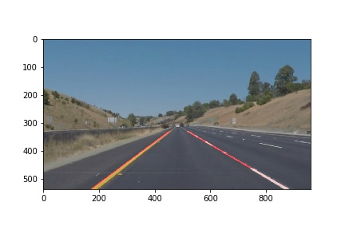

# **Finding Lane Lines on the Road** 

My pipeline Consists of seven functions , These are 
1.select_color
2.select_region
3.detect_edges
4.detect_lines
5.draw_continuous_lines
6.process_image
7.add_lines_to_image

Select_color function identifies the lane based on color , which is tuned to detect the white lanes by setting the red_threshold,green_threshold and blue_thrshold =200.

Select_region function helps to select the polygonal image where the lane will most likely be situated.

detect_edges function detects the edges using canny edge detector ,Before calling the canny function , i called the GaussianBlur function , which helped me to supressing the noise and spurius gradients by averaging. The kernal size must be odd number so i set kernal size as 5 for smoothening ober the large area.
later i called canny function to find the edges by setting low and high threshold as 200 and 300(low to high ratio)

detect_lines function helps to find the lines in the image using Hough Transform by setting the different parameter with the right values.
rho = 1  resolution of the parameter rho, in pixels
theta = np.pi/120 resolution of parameter theta, in radians
threshold = 20 only lines that get more votes than threshold are returned
min_line_len = 10  minimum length of line, in pixels
max_line_gap = 5  maximum allowed gap between line segments, in pixels

draw_continuous_lines function , extrapolate existing lines to draw two converging lanes.

I used for loop to test all the images directory test_images/

Given test images are solidWhiteCurve.jpg,solidYellowCurve.jpg , solidYellowLeft.jpg, solidYellowCurve2, solidWhiteRight.jpg, whiteCarLaneSwitch  

The input image 

The output image

I would like to share some thoughts on how my pipeline more robus:
    A lot that can be improved in future but since this is my first project so i belive the result is reasonable.I want to work more on the approch to draw continious lines,to be more robust to failure.one thing that can be implemented is if cant detect any lanes for the dashed lane , i can infer the hidden lane by the position of the opposit lane.and can compare both the lines continiously to ensure they are consistent with one another.
    for the video , another way is to compare the lane functions between images to guarantee consistency . till now, in a few frames it fails to detect aany lines and the lines are drwan in different places, even if for a split of a second.
